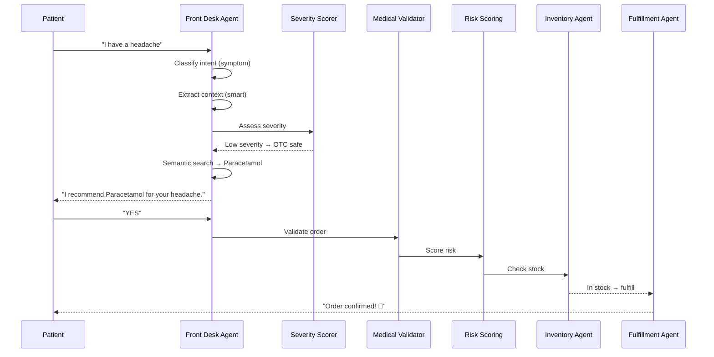

<p align="center">
  <h1 align="center">💊 MediSync</h1>
  <p align="center"><strong>AI-Powered Pharmacy Automation System with Multi-Agent Orchestration</strong></p>
  <p align="center">
    <em>Intelligent medicine recommendations · Prescription OCR · Voice input · WhatsApp integration · Real-time admin dashboard</em>
  </p>
</p>

---

## Overview

MediSync is a production-grade, AI-driven pharmacy management system that automates the entire patient-to-order pipeline. Built on a **multi-agent architecture** powered by [LangGraph](https://github.com/langchain-ai/langgraph), it orchestrates specialized agents that handle everything from symptom intake and clinical validation to inventory management and order fulfillment — all through a natural conversational interface.

The system supports **multi-channel communication** (Web Chat, WhatsApp, Voice), **multi-language input** (English, Hindi, Marathi, Hinglish), and ships with a full **admin dashboard** for real-time pharmacy operations management.

---

## Key Features

### 🤖 Agentic AI Pipeline

- **12 Specialized Agents** orchestrated via a deterministic LangGraph state machine
- Conversational symptom triage with smart context gathering
- Semantic medicine search using sentence-transformers
- ATC-based medicine replacement engine with contraindication safety gates
- Behavioral risk scoring and severity assessment

### 💬 Multi-Channel

- **Web Chat** — React-based conversational UI with real-time agent trace visualization
- **WhatsApp** — Full conversational flow via Twilio Sandbox
- **Voice Input** — Offline speech-to-text via Faster Whisper

### 📸 Prescription Processing

- **Offline OCR** via EasyOCR — no cloud dependency for prescription scanning
- Structured extraction of medicine names, dosages, and quantities from handwritten prescriptions

### 🌐 Multi-Language Support

- Automatic language detection (English, Hindi, Marathi, Hinglish)
- Language-aware prompts and responses across all agents

### 📊 Admin Dashboard

- Real-time inventory management
- Order tracking and fulfillment status
- Customer management and behavioral analytics
- Pending approvals for pharmacist-override situations

---

## Architecture

```
┌──────────────────────────────────────────────────────────┐
│                     CHANNELS                             │
│   Web Chat  ·  WhatsApp (Twilio)  ·  Voice (Whisper)     │
└────────────────────────┬─────────────────────────────────┘
                         │
                    FastAPI Gateway
                         │
          ┌──────────────┴──────────────┐
          │     FRONT DESK AGENT        │
          │  Intent Classification      │
          │  Patient Context Extraction │
          │  Language Detection          │
          └──────────────┬──────────────┘
                         │
              ┌──────────▼──────────┐
              │   LANGGRAPH STATE   │
              │      MACHINE        │
              │                     │
              │  Medical Validator  │
              │        ↓            │
              │  Risk Scoring       │
              │        ↓            │
              │  Inventory Agent    │
              │        ↓            │
              │  Fulfillment Agent  │
              └──────────┬──────────┘
                         │
              ┌──────────▼──────────┐
              │    EVENT BUS        │
              │  (Notifications)    │
              └─────────────────────┘
```

### Agent Pipeline

| Agent                            | Role                                                                 |
| -------------------------------- | -------------------------------------------------------------------- |
| **Identity Agent**               | Patient recognition and session initialization                       |
| **Front Desk Agent**             | Conversational intake, intent classification, context extraction     |
| **Severity Scorer**              | Triages symptoms by severity (emergency → doctor referral → OTC)     |
| **Medical Validator**            | Drug safety checks, prescription requirements, interaction screening |
| **Risk Scoring Agent**           | Behavioral risk assessment based on patient history                  |
| **Clinical Reasoning Agent**     | Advanced clinical decision support                                   |
| **Inventory Agent**              | Stock verification, ATC-based replacement engine with safety gates   |
| **Fulfillment Agent**            | Order creation, stock deduction, confirmation flow                   |
| **Vision Agent**                 | Prescription image processing via EasyOCR                            |
| **Proactive Intelligence Agent** | Scheduled refill predictions and batch analytics                     |
| **Notification Agent**           | Event-driven alerts (order confirmations, reminders)                 |
| **Orchestrator Agent**           | High-level workflow coordination                                     |

### Supported Intents

| Intent                | Description                                      |
| --------------------- | ------------------------------------------------ |
| `symptom`             | Symptom-based medicine recommendation            |
| `known_medicine`      | Direct medicine request by name                  |
| `prescription_upload` | Prescription image for OCR processing            |
| `general_inquiry`     | Small talk, pharmacy hours, general questions    |
| `alternative_request` | Request for a different medicine after rejection |

---

## Tech Stack

### Backend

| Technology                | Purpose                                          |
| ------------------------- | ------------------------------------------------ |
| **FastAPI**               | REST API framework                               |
| **LangGraph**             | Agent orchestration state machine                |
| **LangChain + Gemini**    | LLM integration (Google Gemini + Groq fallback)  |
| **Sentence Transformers** | Semantic intent classification + medicine search |
| **EasyOCR**               | Offline prescription OCR                         |
| **Faster Whisper**        | Offline speech-to-text                           |
| **SQLAlchemy + SQLite**   | Database ORM (PostgreSQL-ready via Supabase)     |
| **Twilio**                | WhatsApp messaging integration                   |
| **Langfuse**              | LLM observability and tracing                    |
| **APScheduler**           | Proactive refill prediction scheduler            |

### Frontend

| Technology               | Purpose                      |
| ------------------------ | ---------------------------- |
| **React 19**             | UI framework                 |
| **Vite**                 | Build tool and dev server    |
| **Tailwind CSS**         | Utility-first styling        |
| **Zustand**              | Lightweight state management |
| **Framer Motion + GSAP** | Animations and transitions   |
| **Recharts**             | Admin dashboard charts       |
| **React Router**         | Client-side routing          |
| **Axios + React Query**  | API communication            |

---

## Project Structure

```
Medisync/
├── startMedisync.sh              # One-command launcher (backend + frontend + tunnel)
├── backend/
│   ├── main.py                   # FastAPI entrypoint
│   ├── requirements.txt
│   ├── .env                      # API keys and configuration
│   ├── hackfusion.db             # SQLite database
│   ├── data/                     # Medicine seed data (meds.xlsx)
│   ├── src/
│   │   ├── graph.py              # LangGraph state machine definition
│   │   ├── state.py              # PharmacyState (shared agent memory)
│   │   ├── agents/               # 12 specialized agents
│   │   ├── services/             # 24 business services
│   │   ├── routes/               # FastAPI route handlers
│   │   ├── events/               # Event bus + notification handlers
│   │   ├── models.py             # SQLAlchemy ORM models
│   │   └── database.py           # Database abstraction layer
│   ├── tests/                    # Test suite
│   └── scripts/                  # Utility scripts
├── frontend/
│   ├── src/
│   │   ├── App.jsx               # Router (Landing / Chat / Admin)
│   │   ├── pages/                # Page components
│   │   │   ├── ChatInterface/    # Main conversational UI
│   │   │   ├── TheatrePage/      # Order theatre with agent traces
│   │   │   ├── LandingPage/      # Marketing landing page
│   │   │   └── admin/            # Admin dashboard suite
│   │   ├── components/           # Reusable UI components
│   │   ├── state/                # Zustand stores
│   │   └── services/             # API service layer
│   └── package.json
```

---

## Getting Started

### Prerequisites

- **Python 3.11+**
- **Node.js 18+**
- **8 GB RAM minimum** (models are optimized for CPU)

### 1. Clone and Setup Backend

```bash
git clone https://github.com/GhananilShirpurkar/Medisync.git
cd Medisync

# Create and activate virtual environment
cd backend
python -m venv .venv
source .venv/bin/activate

# Install PyTorch (CPU-only) first
pip install torch torchvision --index-url https://download.pytorch.org/whl/cpu

# Install dependencies
pip install -r requirements.txt
```

### 2. Configure Environment

Copy the `.env.example` to `.env` in the `backend/` directory and configure:

```env
# Required — LLM API Keys
GEMINI_API_KEY=your_gemini_api_key
GROQ_API_KEY=your_groq_api_key

# Required — Database
DATABASE_URL=sqlite:///./hackfusion.db

# Optional — WhatsApp (Twilio)
TWILIO_ACCOUNT_SID=your_sid
TWILIO_AUTH_TOKEN=your_token
TWILIO_WHATSAPP_FROM=whatsapp:+14155238886

# Optional — Observability
LANGFUSE_SECRET_KEY=your_key
LANGFUSE_PUBLIC_KEY=your_key
LANGFUSE_BASE_URL=https://cloud.langfuse.com
```

### 3. Setup Frontend

```bash
cd frontend
npm install
```

### 4. Launch Everything

The project ships with a single launcher script that starts the backend, frontend, and public tunnel:

```bash
chmod +x startMedisync.sh
./startMedisync.sh
```

This will:

- Start the **FastAPI backend** on `http://localhost:8000`
- Start the **Vite dev server** on `http://localhost:5173`
- Start an **ngrok tunnel** for public access (WhatsApp webhooks)

### 5. Seed the Database

On first run, the backend automatically:

- Initializes the SQLite schema
- Indexes all medicines for semantic search
- Pre-warms the intent classifier and Whisper models

---

## API Documentation

Once the backend is running, interactive API docs are available at:

- **Swagger UI**: [http://localhost:8000/docs](http://localhost:8000/docs)
- **ReDoc**: [http://localhost:8000/redoc](http://localhost:8000/redoc)

### Core Endpoints

| Method | Endpoint                   | Description                                |
| ------ | -------------------------- | ------------------------------------------ |
| `POST` | `/api/conversation/send`   | Send a message to the conversational agent |
| `POST` | `/api/prescription/upload` | Upload a prescription image for OCR        |
| `GET`  | `/api/v1/inventory`        | Query medicine inventory                   |
| `GET`  | `/api/v1/orders`           | List orders                                |
| `GET`  | `/api/v1/admin/dashboard`  | Admin dashboard data                       |
| `POST` | `/api/webhook/whatsapp`    | Twilio WhatsApp webhook                    |
| `GET`  | `/health`                  | Liveness probe                             |

---

## How It Works

### Patient Flow



### Out-of-Stock Replacement

When a requested medicine is unavailable, the system automatically:

1. **Queries the ATC hierarchy** to find pharmacologically equivalent alternatives
2. **Runs contraindication checks** against the patient's profile
3. **Scores confidence** (high = same molecule, medium = same class, low = same category)
4. **Swaps the order item** with the best replacement
5. **Presents to the user** for approval before proceeding

---

## WhatsApp Integration

MediSync integrates with WhatsApp via the **Twilio Sandbox**:

1. Configure your Twilio Sandbox webhook to point to:

   ```
   https://your-ngrok-domain.ngrok-free.dev/api/webhook/whatsapp
   ```

2. Send `join <sandbox-code>` to the Twilio Sandbox number

3. Start chatting — the full agent pipeline works over WhatsApp including:
   - Symptom triage and medicine recommendations
   - Prescription photo uploads (send as image)
   - Voice messages (auto-transcribed via Whisper)
   - Order confirmations

---

## Admin Dashboard

Access the admin panel at `/admin` with features including:

- **Dashboard** — Real-time sales metrics, order volume charts, revenue tracking
- **Inventory** — Medicine stock levels, low-stock alerts, category management
- **Orders** — Full order lifecycle tracking with status updates
- **Customers** — Patient profiles with behavioral risk scores
- **Pending** — Pharmacist-override queue for flagged orders

---

## Observability

MediSync uses **Langfuse** for LLM observability:

- Trace every LLM call with input/output logging
- Monitor latency, token usage, and error rates
- Full conversation replay with agent decision traces

The frontend also displays a real-time **Agent Trace Panel** showing the decision path for each conversation turn.

---

## Development

```bash
# Run backend only (with hot reload)
cd backend && uvicorn main:app --reload --port 8000

# Run frontend only
cd frontend && npm run dev

# Run tests
cd backend && pytest tests/
```

---

## License

This project is proprietary. All rights reserved.
